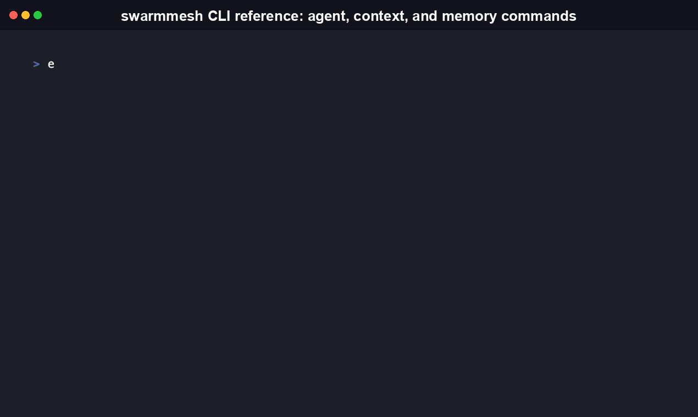
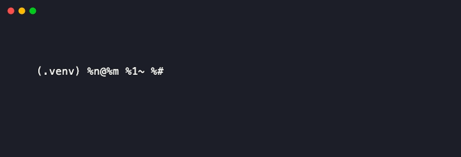

# SwarmMesh

[](https://github.com/RudrenduPaul/swarmmesh/actions/workflows/ci-python.yml)
[](https://github.com/RudrenduPaul/swarmmesh/actions/workflows/ci-node.yml)
[](https://pypi.org/project/swarmmesh-cli/)
[](https://www.npmjs.com/package/swarmmesh-cli)
[](LICENSE)

[Install](#install) • [Quickstart](#quickstart) • [Features](#features) • [CLI reference](#cli-reference) • [Compare](#how-swarmmesh-compares) • [FAQ](#faq)

**Shared context and memory for swarms of parallel AI agents, over a small
protocol both Python and Node speak the same way.**


Spin up ten coding agents on the same task and they cannot see what each
other found. One agent rediscovers a bug another already fixed. Two agents
overwrite the same file because neither knew the other touched it. SwarmMesh
is a small server that sits alongside your existing agent framework and gives
every agent process, in any language that can speak HTTP, a shared place to
publish context and search memory.

It is not an orchestration framework. It does not schedule tasks, define
agent roles, or route work between agents. Your existing framework (or your
own code) keeps doing that. SwarmMesh only answers one question: how do
independent agent processes read and write the same shared state.

## Install

```bash
pip install swarmmesh-cli
# or
npm install -g swarmmesh-cli
```

Either gives you a `swarmmesh` command on your `PATH`.

## See it work

This is a real terminal session, not a mockup: a Python-run mesh, a Node
agent writing to it, and a Python agent reading back what the Node agent
wrote. Two different languages, one shared mesh.

```bash
# Terminal 1: start a mesh (Python implementation, but either works)
$ swarmmesh serve --port 8420
INFO: Uvicorn running on http://127.0.0.1:8420

# Terminal 2: a Node agent joins and writes
$ swarmmesh agent register node-agent-1 researcher --port 8420 --json
{ "agent_id": "node-agent-1", "role": "researcher", ... }

$ swarmmesh context set interop-demo status '"investigating flaky test"' \
    --agent-id node-agent-1 --port 8420 --json
{ "namespace": "interop-demo", "key": "status", "value": "investigating flaky test", ... }

$ swarmmesh memory write interop-demo \
    "found a race condition in the retry loop" --agent-id node-agent-1 --port 8420 --json
{ "namespace": "interop-demo", "text": "found a race condition in the retry loop", ... }

# Terminal 3: a Python agent joins the same mesh and reads it back
$ swarmmesh context get interop-demo status --port 8420 --json
{ "value": "investigating flaky test", "updated_by": "node-agent-1", ... }

$ swarmmesh memory query interop-demo "race condition" --port 8420 --json
{ "results": [{ "entry": { "text": "found a race condition in the retry loop" }, "score": 0.575 }] }
```

Every command above was re-run for real against both CLIs while writing this
README: the Node CLI registered an agent and wrote context and memory
against a Python-hosted mesh, and the Python CLI read it straight back, in
the same run, over the real HTTP API, with the score above (0.575)
reproduced exactly. No shared filesystem, no shared process, no translation
layer. Just the protocol.

## Quickstart

```bash
# Start a mesh (in-memory by default; add --persist ./mesh.db for SQLite storage)
swarmmesh serve --host 127.0.0.1 --port 8420

# From another terminal: register an agent
swarmmesh agent register agent-1 researcher

# Publish and read shared context
swarmmesh context set my-run phase '"planning"' --agent-id agent-1
swarmmesh context get my-run phase

# Write and search shared memory
swarmmesh memory write my-run "found a race condition in the retry loop" --agent-id agent-1
swarmmesh memory query my-run "race condition"

# Check what's on the mesh
swarmmesh status --json
```

This exact sequence was run end to end while writing this README and
completed in a few seconds, start to finish, against the real
`swarmmesh-cli` package installed from PyPI.

To build from source instead of installing from a registry:

```bash
# Python
git clone https://github.com/RudrenduPaul/swarmmesh.git
cd swarmmesh
pip install -e python/

# Node
cd swarmmesh/node
npm install
npm run build
npm link
```

## Features

- **A documented wire protocol.** [`docs/protocol.md`](docs/protocol.md)
  specifies every HTTP endpoint and WebSocket event, so any process that can
  speak HTTP and JSON can join a mesh. The two official CLIs are convenient
  clients, not the only valid ones.
- **Two independent, interoperating implementations.** Python
  (`swarmmesh-cli` on PyPI, FastAPI + Typer, 74 tests, 91% statement
  coverage) and Node (`swarmmesh-cli` on npm, Express + commander, 65 tests,
  91.64% statement coverage) implement the protocol identically. Each
  package's own test suite runs independently in CI; cross-language interop
  (a Node client against a Python-hosted server and back) is demonstrated in
  the "See it work" section above and was re-run by hand against both real
  packages, not covered by an automated cross-language test in CI today.
- **Real-time updates over WebSocket.** `/v1/events` pushes
  `context.updated`, `context.deleted`, `memory.written`,
  `agent.registered`, and `agent.deregistered` frames so an agent can react
  the moment another agent changes shared state, instead of polling.
- **Honest memory search.** Memory queries use Okapi BM25 keyword ranking:
  real term-frequency scoring, computed locally with no extra dependencies
  and no network calls. It is not semantic or embedding search. A
  `RankingBackend` interface is a documented extension point if you want to
  plug in your own embedding-based scorer; SwarmMesh doesn't ship one.
- **Pluggable storage.** In-memory by default (process lifetime only), or
  `--persist <path>` for SQLite-backed storage that survives restarts.
- **Agent-native by default.** Every subcommand on both CLIs supports
  `--json` for structured, script-parseable output, and both ship a
  `swarmmesh mcp` subcommand that starts an MCP server over stdio so an
  MCP-capable agent (Claude or otherwise) can call SwarmMesh as a set of
  tools without shelling out.
- **A deliberately small trust boundary.** Both servers bind to
  `127.0.0.1` by default, not `0.0.0.0`. There's no authentication in v1.
  See [Security](#security).

The number below is measured, not estimated. 50 sequential `PUT /v1/context/{namespace}/{key}`
requests against a local Python-run server averaged 0.8ms round trip each
(40ms total for 50 requests) on the machine this README was written on.
This isn't a rigorous benchmark, includes `curl`'s own process-spawn
overhead per request, and will vary by machine, but it's a real number from
a real run, not a guess. Reproduce it yourself with:
```bash
for i in $(seq 1 50); do curl -s -o /dev/null -w "%{time_total}\n" \
  -X PUT "http://127.0.0.1:8420/v1/context/bench/key$i" \
  -H "Content-Type: application/json" -d "{\"value\":\"v$i\",\"agent_id\":\"bench\"}"; done
```

## CLI reference

Both CLIs expose the same command tree. Flag names differ slightly between
the two (Python uses Typer's `--flag <value>` style, Node uses commander's),
but the commands and their behavior are identical. Output below is
transcribed from running `--help` on each built CLI.



```
swarmmesh serve [--host HOST] [--port PORT] [--persist PATH]
    Start a SwarmMesh coordination server.

swarmmesh status [--host HOST] [--port PORT] [--json]
    Show a mesh status snapshot (agent count, namespaces, entry counts, uptime).

swarmmesh mcp [--host HOST] [--port PORT]
    Start an MCP server over stdio, proxying tool calls to a running mesh.

swarmmesh agent register <agent_id> <role> [--metadata JSON] [--host HOST] [--port PORT] [--json]
swarmmesh agent list [--host HOST] [--port PORT] [--json]
swarmmesh agent deregister <agent_id> [--host HOST] [--port PORT] [--json]

swarmmesh context set <namespace> <key> <value> [--agent-id ID] [--ttl SECONDS] [--host HOST] [--port PORT] [--json]
swarmmesh context get <namespace> <key> [--host HOST] [--port PORT] [--json]
swarmmesh context list <namespace> [--host HOST] [--port PORT] [--json]
swarmmesh context delete <namespace> <key> [--host HOST] [--port PORT] [--json]

swarmmesh memory write <namespace> <text> [--agent-id ID] [--metadata JSON] [--id ID] [--host HOST] [--port PORT] [--json]
swarmmesh memory query <namespace> <query> [--top-k N] [--host HOST] [--port PORT] [--json]
```



`context set` parses `<value>` as JSON, falling back to a plain string if it
isn't valid JSON. `context set ns key '"planning"'` stores the string
`planning`. So does `context set ns key planning` (no quotes), through the
same string fallback.

## Library API reference

Both packages export a typed client so you can call a mesh directly from
your own agent code instead of shelling out to the CLI. Signatures below are
grepped straight from source, not from memory.

**Python** (`swarmmesh_cli.client.SwarmMeshClient`):

```python
class SwarmMeshClient:
    def __init__(self, base_url: str = DEFAULT_BASE_URL, timeout: float = 10.0) -> None: ...
    async def register_agent(self, agent_id: str, role: str, metadata: dict | None = None) -> dict: ...
    async def deregister_agent(self, agent_id: str) -> None: ...
    async def list_agents(self) -> dict: ...
    async def publish_context(self, namespace: str, key: str, value, agent_id: str, ttl_seconds: int | None = None) -> dict: ...
    async def get_context(self, namespace: str, key: str) -> dict: ...
    async def list_context(self, namespace: str) -> dict: ...
    async def delete_context(self, namespace: str, key: str) -> None: ...
    async def write_memory(self, namespace: str, text: str, agent_id: str, metadata: dict | None = None) -> dict: ...
    async def query_memory(self, namespace: str, query: str, top_k: int = 10) -> dict: ...
    async def get_status(self) -> dict: ...
```

**Node / TypeScript** (`SwarmMeshClient` from `swarmmesh-cli`):

```typescript
class SwarmMeshClient {
  constructor(options?: SwarmMeshClientOptions);
  registerAgent(agentId: string, role: string, metadata?: Record<string, JsonValue>): Promise<Agent>;
  deregisterAgent(agentId: string): Promise<void>;
  listAgents(): Promise<Agent[]>;
  publishContext(namespace: string, key: string, value: JsonValue, agentId: string, ttlSeconds?: number): Promise<ContextEntry>;
  getContext(namespace: string, key: string): Promise<ContextEntry | null>;
  listContext(namespace: string): Promise<ContextEntry[]>;
  deleteContext(namespace: string, key: string): Promise<void>;
  writeMemory(namespace: string, text: string, agentId: string, metadata?: Record<string, JsonValue>): Promise<MemoryEntry>;
  queryMemory(namespace: string, query: string, topK?: number): Promise<MemoryQueryResult[]>;
  getStatus(): Promise<StatusSnapshot>;
}
```

## The SwarmMesh protocol

The full specification lives in [`docs/protocol.md`](docs/protocol.md). The
short version: a "mesh" is one running `swarmmesh serve` process. Agents are
independent processes (coding agents, research agents, subprocess workers,
anything that can make an HTTP request) that register with a mesh, then
read and write namespaced shared context and memory through it.

The point of writing this down as a protocol instead of just shipping a
library is that it means the two official CLIs aren't the only valid
clients. A Python agent using `swarmmesh_cli.client.SwarmMeshClient`, a Node
agent using the `SwarmMeshClient` from `swarmmesh-cli`, and a third agent
written in a language with neither package can all register with the same
mesh and see each other's context and memory, because they're all just
calling the same documented HTTP endpoints and, optionally, subscribing to
the same WebSocket event stream. Nothing about interop depends on a shared
runtime, a shared process, or a shared filesystem.

## How SwarmMesh compares

There's no other project doing exactly what SwarmMesh does, so this isn't an
apples-to-apples table. It's here to be honest about what two real,
comparable multi-agent projects actually offer versus what SwarmMesh
actually offers, checked directly against their READMEs and source, not
assumed from their names. Both are older, larger, and more established than
SwarmMesh, which has 0 GitHub stars and no known users yet.

| | **SwarmMesh** | **[kyegomez/swarms](https://github.com/kyegomez/swarms)** | **[companion-inc/feynman](https://github.com/companion-inc/feynman)** |
|---|---|---|---|
| What it is | Shared context/memory coordination layer (infrastructure, not a framework) | Multi-agent orchestration framework | AI research agent with a local workbench UI |
| Stars | 0 | 7,024 | 8,447 |
| Primary language | Python + TypeScript (two tested implementations) | Python | TypeScript |
| License | MIT | Apache-2.0 | MIT |
| Install | `pip install swarmmesh-cli` / `npm install -g swarmmesh-cli` | `pip3 install -U swarms` | `curl -fsSL https://feynman.is/install \| bash` |
| Documented cross-language wire protocol for shared context/memory | Yes: [`docs/protocol.md`](docs/protocol.md), HTTP + WebSocket, two independent implementations verified interoperable by hand (see "See it work" above) | Not as a headline feature. AOP is a real protocol for deploying and calling a named remote agent as a distributed service, but its documented example is Python-only with no language-agnostic wire format specified. A `RedisConversation` backend exists as an example utility, not documented cross-language coordination. | None found. `feynman serve` runs a local, human-facing workbench UI. State lives in a local SQLite mirror under `~/.feynman/`, not behind a documented agent-to-agent API. |
| Built-in orchestration patterns (sequential, hierarchical, task routing) | None by design. SwarmMesh expects you to bring an orchestrator | Yes, many. This is the core of what swarms does | Some, internal to its own research workflow, not exposed as a general SDK |
| Memory search | Keyword (BM25), explicitly not semantic | Not the focus of the project | Not the focus of the project |

The honest read: swarms has real orchestration depth and a large community
that SwarmMesh doesn't try to replace. feynman is a polished end-user
research tool, not infrastructure you'd embed elsewhere. SwarmMesh's actual
claim is narrower than either: a small, documented protocol two languages
already speak the same way. It's worth exactly that much, no more.

## What SwarmMesh is, and why it exists

Multi-agent setups increasingly mean several agent processes working the
same problem in parallel, sometimes in the same language, sometimes not,
sometimes spawned by different tools entirely. Orchestration frameworks
solve the "what should each agent do and in what order" problem. SwarmMesh
solves a narrower, adjacent problem: once those agents are running, how do
they tell each other what they've found without a human relaying messages
between terminals or agents silently duplicating each other's work.

SwarmMesh is infrastructure, not a framework. It doesn't care what
orchestrator spawned your agents, if any. It exposes a small HTTP + WebSocket
surface for shared context (structured key-value state, like a run's current
phase) and shared memory (free-text notes agents leave for each other,
searchable by keyword). You point your agents at a `swarmmesh serve` process
the same way you'd point them at a Redis instance, and they have a shared
place to read and write.

## FAQ

**Is this a replacement for LangGraph / CrewAI / AutoGen / \<my orchestration
framework\>?**
No. SwarmMesh doesn't schedule agents, define workflows, or decide what
happens next. It runs alongside whatever you use for that and gives the
agents it spawns a shared context and memory layer. Point your orchestrator's
agents at a `swarmmesh serve` process and keep using it for everything else.

**How is this different from kyegomez/swarms or companion-inc/feynman?**
Both are larger, older projects solving different problems. swarms is an
orchestration framework: it decides what agents run, in what order, and how
they hand off work, and it does that at real depth. SwarmMesh doesn't do any
of that; it only gives already-running agents a shared place to read and
write state. feynman is a single research-agent product with a local
workbench UI and its own SQLite-backed state, not a coordination layer other
projects embed. Neither ships a documented cross-language wire protocol for
shared agent memory the way SwarmMesh's `docs/protocol.md` does. Full
side-by-side above in [How SwarmMesh compares](#how-swarmmesh-compares).

**Is the memory search semantic / embedding-based?**
No. It's Okapi BM25 keyword ranking, the same family of algorithm search
engines have used for decades, computed locally over term frequency. It
won't find memory entries that are conceptually related but share no
vocabulary with your query. If you need that, the `RankingBackend` interface
is a documented extension point for wiring in your own embedding-based
scorer. SwarmMesh doesn't ship one and won't silently call an embedding API
on your behalf.

**Can a Python agent and a Node agent really share state, or is that
theoretical?**
This is the reason the project exists. Both CLIs implement the same wire
protocol in [`docs/protocol.md`](docs/protocol.md), and the "See it work"
section above is a real transcript of the Node CLI writing context and
memory to a Python-hosted server, then the Python CLI reading it back over
the network, re-verified while writing this README.

**Does SwarmMesh persist data?**
Only if you ask it to. `swarmmesh serve` defaults to in-memory storage that's
gone when the process exits. Pass `--persist <path>` for SQLite-backed
storage that survives restarts.

**Is there authentication?**
Not in v1. See [Security](#security) below: this is a deliberate scope
boundary, not an oversight.

**What happens if two agents write to the same context key?**
Last write wins. `PUT /v1/context/{namespace}/{key}` overwrites whatever
was there. Every write broadcasts a `context.updated` WebSocket event, so
agents subscribed to that namespace find out immediately rather than
polling. There's no merge or conflict resolution; if your agents need that,
build it on top using distinct keys or your own versioning convention.

**Can I use SwarmMesh as a library instead of the CLI?**
Yes. Both packages export a client: `swarmmesh_cli.client.SwarmMeshClient`
in Python, `SwarmMeshClient` from `swarmmesh-cli` in Node. See
[Library API reference](#library-api-reference) above for real method
signatures.

**Can I run this on more than one machine, and is it production-ready?**
Nothing stops a mesh from being reachable across a network; `--host` binds
to any interface you point it at. But there's no authentication in v1 (see
[Security](#security)), so treat it like a local Redis instance, not a
public-internet-facing service. It also has 0 known production users at
this point, so evaluate accordingly.

**Is it free to use commercially?**
Yes. SwarmMesh is MIT licensed, on both the Python and Node packages and the
repository itself. Use it in a commercial product without asking permission
or paying anything.

## Security

> [!WARNING]
> SwarmMesh has no authentication in v1. Running a SwarmMesh server directly
> exposed to the public internet without a reverse proxy adding
> authentication is a misconfiguration, not a supported deployment.

Both the Python and Node servers bind to `127.0.0.1` by default, not
`0.0.0.0`. SwarmMesh is designed to run on localhost or inside a private
network alongside the agents it coordinates. That's the same trust boundary
as a local Redis instance or a SQLite file, not a public-internet-facing
service.

Found a vulnerability? Please don't open a public issue. See
[`SECURITY.md`](SECURITY.md) for the private disclosure process.

## Contributing

SwarmMesh has two official implementations of the same protocol, kept
behaviorally identical on purpose. See [`CONTRIBUTING.md`](CONTRIBUTING.md)
for development setup for both, the pull request process, and the ground
rule that shapes everything in this README: no unverified claims. Every
number here has to be reproducible from a real command.

## License

[MIT](LICENSE)
